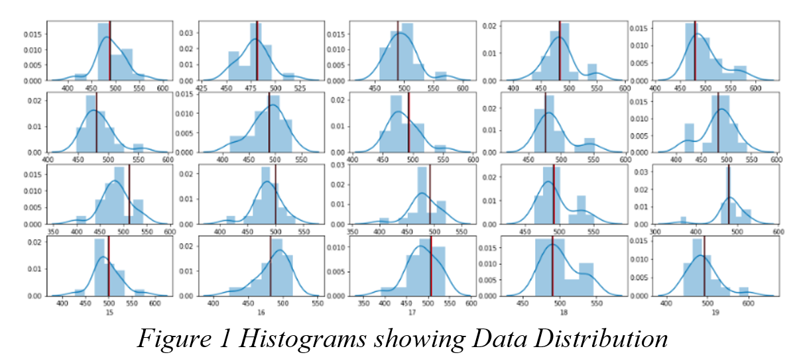

# A Model for Automated Feature Selection 

we investigate multiple techniques and purpose a model for dealing with the feature selection which have been the focus in areas of application for datasets with hundreds and thousands of variables. To this end we utilize a dataset which was prepared artificially for examining feature selection techniques. Our investigation clearly shows that feature selection in datasets where variables do not have significance can enhance the predictive ability of a machine learning algorithm. 

MADELON is an artificial dataset containing data points grouped in 32 clusters placed on the vertices of a five-dimensional hypercube and randomly labeled +1 or -1. The five dimensions constitute 501 features. The dataset was obtained from the UCI Machine Learning Repository

Feature selection is the process of picking those attributes in our dataset (such as columns in a tabular data), which are of most relevance to a problem at hand. For e.g., if we are trying to differentiate a human from a cat, the number of feet would be a relevant feature in our prediction. Although it is possible to select the features using some prior knowledge and other manual techniques, it is not always feasible. Many times, when carrying out feature selection we might be biased with our assumptions while selecting a feature or there may be too many features in a dataset to be conveniently filtered out. 

Motivation for choosing this problem through the "Occam's razor (or Ockham's razor)" principle. It is a problem-solving principle from philosophy which says that if there exist two explanations for an occurrence, the one that needs the smallest number of assumptions is usually correct. i.e. The more assumptions that you have to make, the higher the chances that it is an unlikely explanation. 
Our motivation also stems largely from modelling various machine learning problems in our assignments. Even though we use statistical methods like observing the co-linearity of the variables, it might not be sufficient for making our proposed set of features the most optimal. Also going back and forth to confirm the increase or decrease in accuracy upon selecting our features to decide if we should drop a feature after creating the whole model is not an efficient technique. 

## Data Distribution
Before applying any machine learning or statistical methods, it is crucial to understand the underlying distribution of the data. The distribution of the data helps us clearly state our assumptions and base our models upon them. We visualize the distribution among the attributes by using histograms. Since the number of features is very high, we will plot the histograms by sampling 20 random features out of the 500 as shown in the fig 1. The observations made from the visualization are as follows:
1.	Some of the features are skewed (i.e. the mean and the median are not the same)
2.	Most of the features have a Normal distribution.
3.	Some of the features have a Bimodal distribution.
4.	Outliers are present in the data.

